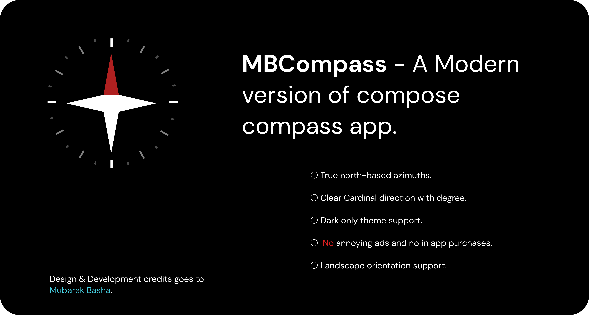
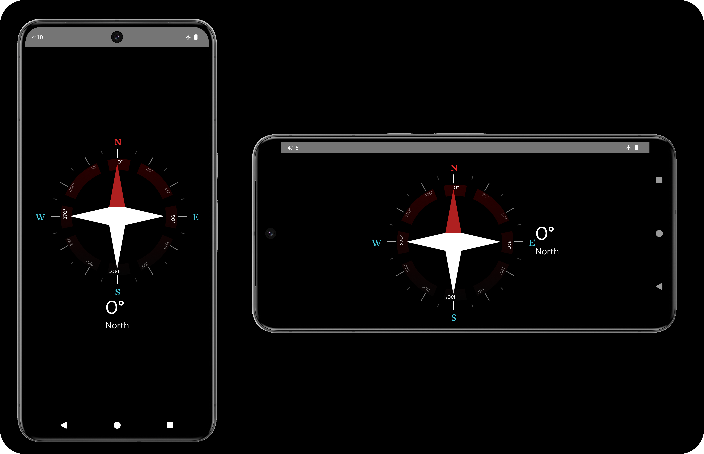
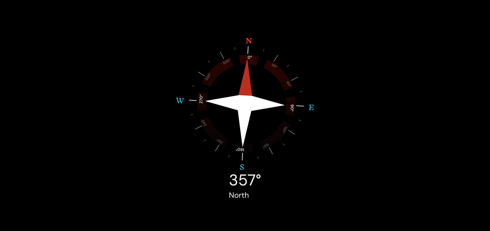

## 🧭MBCompass - Compose Compass App 

### A fully functional compose compass app that uses device magnetometer to find cardinal direction

### Features ✨

- True north-based azimuths.
- Landscape orientation support.
- Clear Cardinal direction degree with custom image.
- Dark only theme support.
- No annoying ads and no in app purchase

### Tech stack 🧱

- UI (`Jetpack compose`).
- Flow Layout
- Android architecture component (`ViewModel`)
- Lifecycle compose android.
- Kotlin `flows`

### Improvements 🚀
This app is currently in development 🛠️. New features and improvements might be added.
